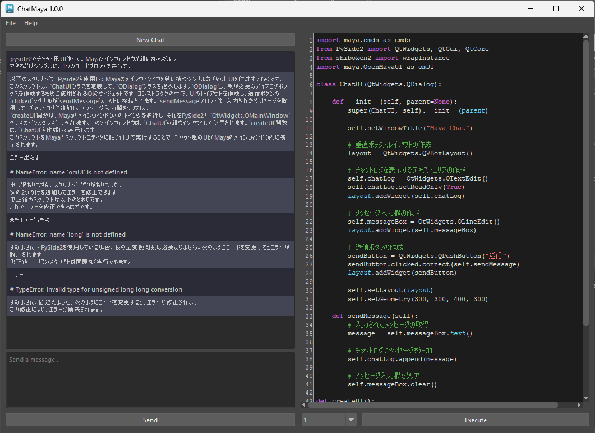

# ChatGPT_Maya
MayaからChatGPT API（[gpt-3.5-turbo](https://platform.openai.com/docs/guides/chat)）を呼び出し、Pythonスクリプトを生成・実行させるGUIです。  

テスト環境 :
* Maya 2023 (Python3.9.7)
* openai 0.27.4

## 環境構築
> **Note**  
> 以下はAnaconda仮想環境を使用していますが、追加パッケージがMayaにインストールできていればどんな方法でも問題ありません。

1. [Account API Keys - OpenAI API](https://platform.openai.com/account/api-keys)よりAPI Keyを取得し、環境変数`OPENAI_API_KEY`に設定する  


2. 仮想環境を作成しMayaと同じバージョンのPythonを入れる
```
conda create -n maya2023 python=3.9.7
conda activate maya2023
```

3. 仮想環境に追加パッケージを入れる
```
pip install -r requirements.txt
```

4. `PYTHONPATH`に仮想環境のパッケージフォルダ`~\site-packages`と`chatmaya`の親フォルダを追加し、Maya起動する
```batchfile
@echo off
set PYTHONPATH=%UserProfile%\Anaconda3\envs\maya2023\Lib\site-packages;<chatmayaの親フォルダ>
start "" "%ProgramFiles%\Autodesk\Maya2023\bin\maya.exe"
exit
```

## 使用方法
```python
import chatmaya
chatmaya.run()
```

* 左側下部のテキストフィールドにプロンプトを打ち込み送信ボタンを押すとAPIにリクエストが送信され返答が表示されます。
* 返答はPythonコードとその他の部分に分解されそれぞれのフィールドに表示されます。
* ChatGPTが複数のコードブロックを書いてきた場合は、右側下部のプルダウンから選択出来るようになります。
* New Chatを押すかウィンドウを閉じるまでは、直前までの会話を記憶した状態になります。
* ログや設定ファイルは`C:\Users\<ユーザー名>\Documents\maya\ChatMaya`に出力されています。
* 別途[VOICEVOX ENGINE](https://github.com/VOICEVOX/voicevox_engine)が起動している状態だと、自動的にコードブロック以外の部分の音声合成と読み上げが行われます。



## リンク
### 解説, サンプル
※[beta](https://github.com/akasaki1211/ChatGPT_Maya/tree/beta)時点での解説です
* [ChatGPT API を使用してMayaを（Pythonスクリプトで）操作してもらう - Qiita](https://qiita.com/akasaki1211/items/34d0f89e0ae2c6efaf48)
* [サンプル(Twitter)](https://twitter.com/akasaki1211/status/1632704327340150787)

### コード参考
* [ChatGPT APIを使ってAIキャラクターを作ってみる！ - Qiita](https://qiita.com/sakasegawa/items/db2cff79bd14faf2c8e0)
* [【Python】ChatGPT APIでウェブサイト版のように返答を逐次受け取る方法 - Qiita](https://qiita.com/Cartelet/items/cfc07fc499b6ebbc7dde)